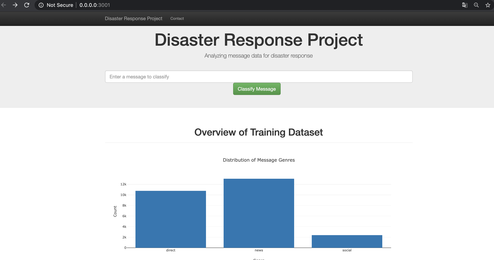
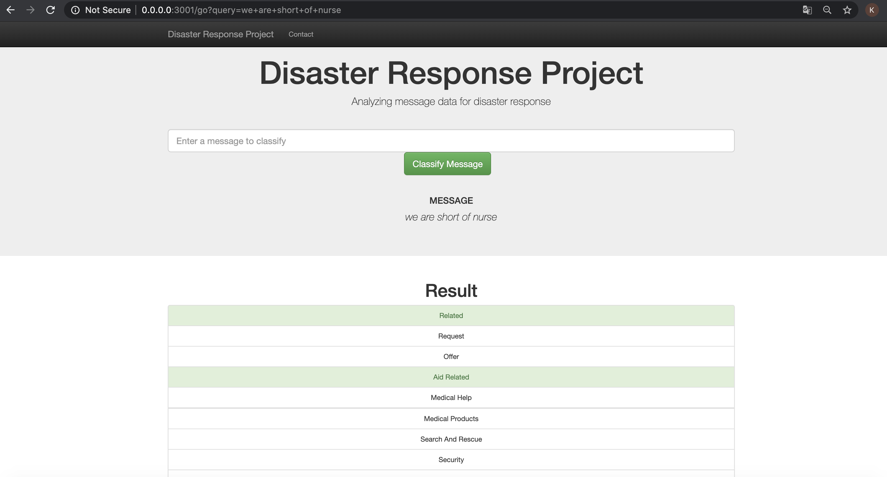

# Disaster Response Pipeline Project

### Overview
This project is from the Udacity Data Scientist Nanodegree Program: Disaster Response Pipeline Project.
The goal is to use the dataset pre-labelled tweet and messages from real-life disaster events provided by Figure 8. 
The project use NLP 
and Machine Learning skills to categorize messages in order to help Disaster Response organizations to filter the most
important messages.

We apply CRISP-DM Process (Cross Industry Process for Data Mining) to tackle the problem.

### Structure of projects
The project is divided in three sections:
* Processing: build an ETL (Extract, Transform, and Load) Pipeline to extract data from the two given .csv files which 
are disaster_categories.csv and disaster_message.csv . Clean the data, and then store it in a SQLite database. 
Details refer to "/data" folder,  process_data.py file for all work,an additional notebook file can facilitate to 
better understand how ETL processing works step by step.
* Machine Learning Pipeline: split the data into a training set and a test set. Then, create a machine learning pipeline
 that uses NLTK, as well as scikit-learn’s Pipeline and GridSearchCV to output a final model that predicts a message 
 classifications for the 36 categories (multi-output classification).Details refer to "/models" folder ,train.py. Also 
 a helpful notebook file can explain the training process step by step.
* We are using Flask -Python for Web App development: 
a web application to show classify messages in real time. Details in "/app" folder

### Screenshot
Two main function: first Pic shows screenshot the dash Web app,  second shows the classification result for any
 query message 

### Evaluate the Results
The dataset is highly imbalanced and that is the reason why the accuracy is high and the recall value is pretty low

### Instructions:
1. Run the following commands in the project's root directory to set up your database and model.

    - To run ETL pipeline that cleans data and stores in database
        `python data/process_data.py data/disaster_messages.csv data/disaster_categories.csv data/DisasterResponse.db`
    - To run ML pipeline that trains classifier and saves
        `python models/train_classifier.py data/DisasterResponse.db models/classifier.pkl`

2. Run the following command in the app's directory to run your web app.
    `python run.py`

3. Go to http://0.0.0.0:3001/
